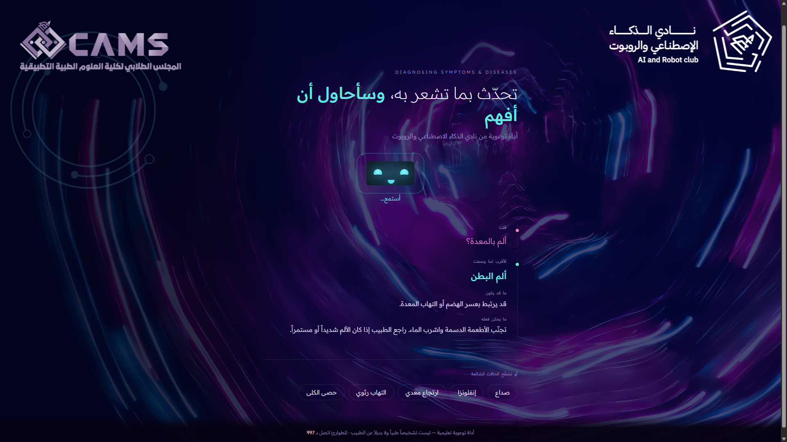
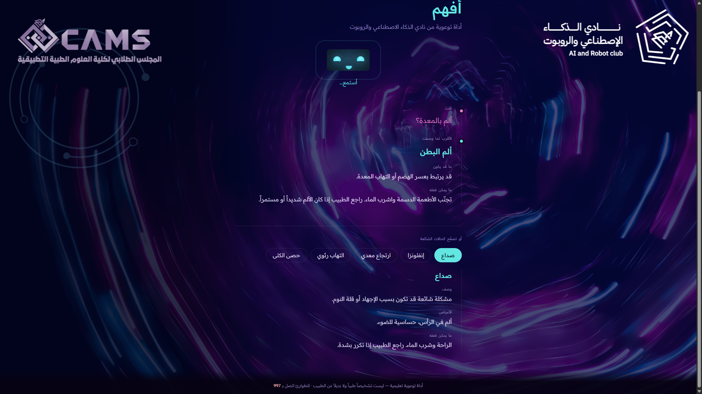

# Medical Diagnosis — Voice-Driven Symptom Checker

A web application that helps people understand what their symptoms might indicate, before they see a doctor. Users can either **speak their symptoms aloud** or select them from a list, and the system returns likely conditions with plain-language descriptions, common signs, and basic guidance.

Built through a collaboration between the **AI & Robot Club** and the **Student Council of the College of Applied Medical Sciences (CAMS)** at Imam Abdulrahman Bin Faisal University.

---

## ⚠️ Important

This is an **educational project**, not a medical device. It does not diagnose illness and must not be used to make health decisions. Anyone with a health concern should consult a qualified healthcare professional.

---

## Features

- Voice-based symptom input using speech recognition.
- Manual symptom selection.
- AI-assisted symptom matching.
- Displays possible medical conditions.
- Provides simple descriptions and general healthcare guidance.
- Clean and user-friendly interface.

---

## Why I built it

The collaboration with CAMS students shaped the whole approach. Their consistent feedback was that symptom-checker tools tend to fail in one of two ways: they either overwhelm people with clinical terminology, or they alarm them by leading with worst-case conditions.

So the design goal was not maximum diagnostic accuracy — it was **appropriate confidence**. Results are framed as possibilities worth discussing with a doctor, never as conclusions. Voice input exists for the same reason: someone feeling unwell should not have to work through a long form to get useful information.

---
## Demo

  
  

Voice-based symptom input and AI-assisted diagnosis results.

---
## Tech Stack

| Component | Technology |
|-----------|------------|
| Frontend | HTML5, CSS3 |
| Programming | JavaScript |
| Voice Recognition | Web Speech API |

---

## Running 

https://rabdullah97.github.io/Medical-Diagnosis/

---

## Acknowledgements

A joint project of the AI & Robot Club and the CAMS Student Council, IAU — November 2024. Thanks to the medical sciences students who reviewed the condition descriptions for clarity and appropriate tone.
